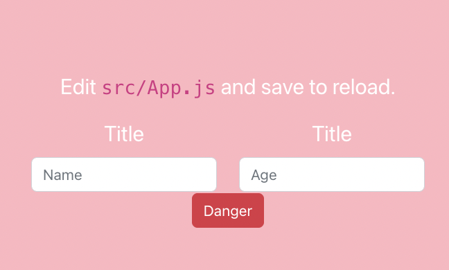

# Premise

I keep hoping to find the perfect step by step guide to build out my dream app. After all, it's basic, yet powerful. It's capable of securely collecting and storing data in a customer frendly interactive platform. Then, last night, it occurred to me that this is **my** ideal project, **nobody elses**. So maybe I have to write that step by step guide. 

So here i go. And I will not hold back on documenting the parts that cause me grief, the things that require thinking (and doing) things through (over and over). 

### Tools

* VS Code
* Github
* React
* Cloudinary
* Mongoose
* Node.js
* Express


## Getting Started: React and Git and VS Code

When you create a react project from the terminal using ```npx create-react-app project-name``` and opening it in VS code using ```code .```, it is all set up to integrate with your external version control. 


* create a new repository on git. I'm naming mine **project-form**. 

* in VSC, open the terminal, control `, and run ```git init``` and then paste the code from github that starts with git clone. Go ahead and add something to the README.md, commit, push, and verify that it works. 

## Launch the React Boilerplate App

```npm start```

Voila, the app works. 

So far we have created a front end web app that is running in a development environment. The app's code is memorialized for safe keeping in a a GitHub repository. 

## Build the Form

Form syntax is easy in react, but if you're not much of a designer, then the interface will be nothing more that a simple boring form. 

### But polish it up with react bootstrap. 

So rather than build muscle memory around the form syntax, let's just immediately work in the bootstrap.  First, add the necessary packages to the project

```npm install bootstrap react-bootstrap sass```

And at the top of the App.js immediately add 

```import 'bootstrap/dist/css/bootstrap.min.css'```


<details>
  <summary> 🪲 🪲 Can't add text in the input box</summary>
  


Make sure it's labeled correctly. 

  **Example**
  ```js
<Form.Control
    onChange={handleChange}
    value={form.name}
    name='name' // I mislabeled this and it didn't work on the UI
    type='text'
    placeholder='Name'
/>
  ```
</details>


<details>
  <summary> 🪲 🪲 Reset form (i.e., clear values) after submit</summary>
  

Why was this hard??? Beats me. All I needed to do was add a command after the last step in the handle submit function, replacing the state with the original state. ```setForm('')```

  **Example**

  ```js
  const handleSubmit = event => {
    event.preventDefault()
    console.log(form)
    setForm('') // I just needed to add this
  }
```
</details>

# 🀟 
Right now is a great place to stop and reflect on some of the tnhings I've done here. We have a bootstrapped form that records inpout and resets a form. We've used layout pieces, Row and Col. We've not only fixed the button sizing...it needed to be placed inside the form, we've also changed the style to brighten it up (red now, was blue) but been able to keep the submit functionality by tying it. So many of the ntegral bootstrap components are contained within this tiny bit of code. The next step is to broaden the bootstrap components to include categories, and then to print the iutput in cards.

Here's that code:

```js
import { useState } from "react"
import Form from 'react-bootstrap/Form';
import Button from 'react-bootstrap/Button'
import Row from 'react-bootstrap/Row'
import Col from 'react-bootstrap/Col'
import styles from './CreateBookmark.module.scss'

export default function CreateBookmark(props) {
    //State to hold the form data
    const [form, setForm] = useState({
        name: "",
        age: 0,
    })

    const handleChange = event => {
        // dynamically update the state using the event object
        // this function always looks the same
        setForm({ ...form, [event.target.name]: event.target.value })
    }
    const handleSubmit = event => {
        // prevent page refresh
        event.preventDefault()
        // do what you want with the form data
        console.log(form)
        setForm('')
    }
    return (
        <Form onSubmit={handleSubmit}>
            <Row>
                <Col>
                    <Form.Group controlId='formBasicTitle'>
                        <Form.Label>Title</Form.Label>
                        <Form.Control
                            onChange={handleChange}
                            value={form.name || ''}
                            name='name'
                            type='text'
                            placeholder='Name'
                        />
                    </Form.Group>
                </Col>
                <Col>
                    <Form.Group controlId='formBasicAge'>
                        <Form.Label>Title</Form.Label>
                        <Form.Control
                            onChange={handleChange}
                            value={form.age || ''}
                            name='age'
                            type='number'
                            placeholder='Age'
                        />
                    </Form.Group>
                </Col>      </Row>
            <Col>
                <Button
                    variant="danger"
                    value="Submit Form"
                    placeholder='Ready?'
                    type="submit">
                    Danger</Button>{' '}
            </Col>
        </Form>
    )
}
```


## More Input Types

### Checkbox

This is a work-in-progress. The data input is being captured correctly as a boolean, however conditional labeling and resetting to an unckecked value are still pending functionalities.

### Categories

<table>
<tr>
<th> React </th>
<th> React-Bootstrap </th>
</tr>
<tr>
<td>

```js
   <label>Pick a category:
            <select 
            
            options={blog.category} 
            value={blog.category} 
            onChange={handleChange} 
            placeholder='Category'
            name="category">
              <option value="Family">Family</option>
              <option  value="Friends">Friends</option>
              <option  value="Work">Work</option>
              <option  value="Code">Code</option>
              <option  value="Misc">Misc</option>
            </select>
            </label>
```

</td>
<td>

```js
 <Form.Group as={Col} controlId="formGridState">
      <Form.Label>Pick a Category</Form.Label>
      <Form.Control 
      
      
      />
      <Form.Select defaultValue="Misc" 
                    options={blog.category} 
            value={blog.category} 
            onChange={handleChange} 
            placeholder='Category'
            name="category" >
      
              <option value="Family">Family</option>
              <option  value="Friends">Friends</option>
              <option  value="Work">Work</option>
              <option  value="Code">Code</option>
              <option  value="Misc">Misc</option>
      </Form.Select>
    </Form.Group>

```

</td>
</tr>
</table>


# Upload photos 

<details>
  <summary> 🪲 🪲 Wasn't showing the image</summary>
 Make sure it's labeled correctly. 

  **Example**
  ```js
 (error, result) => {
        if (!error && result && result.event === "success") {
          console.log("Done! Here is the image info: ", result.info);
          document
            .getElementById("uploadedimage")
            .setAttribute("src", result.info.secure_url); //this is required for displaying the image
             }
      }
  ```
</details>

<details>
  <summary> 🪲 🪲   setAttribute not recognized </summary>
 Make sure it's labeled correctly. 

  **Error**
  setAttribute not recognized. 
  **Solution**
  install packages
  ```js
"@cloudinary/react": "^1.11.2",
        "@cloudinary/url-gen": "^1.10.0",
        "@testing-library/jest-dom": "^5.16.5",
        "cloudinary": "^1.36.2",
        "cloudinary-core": "^2.13.0",
        "cloudinary-react": "^1.8.1",
```

</details>


<details>
  <summary> 🪲 🪲   How to set up a server for an existing React App  </summary>

[Order Matters. Touch server.js before initializing server. ](https://www.section.io/engineering-education/how-to-setup-nodejs-express-for-react/)


  ```js
touch server.js
npm init -y
npm install express --save
const express = require('express'); //Line 1
const app = express(); //Line 2
const port = process.env.PORT || 5000; //Line 3

// This displays message that the server running and listening to specified port
app.listen(port, () => console.log(`Listening on port ${port}`)); //Line 6

// create a GET route
app.get('/express_backend', (req, res) => { //Line 9
  res.send({ express: 'YOUR EXPRESS BACKEND IS CONNECTED TO REACT' }); //Line 10
}); //Line 1
```

</details>


This is, frankly, hard for me. I don't know why. But I suppose I'd rather have an essential part be hard than an ancillary one. 

The way I see it, no matter what, the app will be dependant upon the data that our user will input. Photos will be integral to the data set as a whole, but us ing them as output requires a few transformative steps. This is because our database does not store photos, rather it stores a url link to the photo. So we have to create that url. This is where Cloudinary comes in. Cloudinary stores photos. So all we need to do is have a free account.

We can integrate the necessary functionality to upload, create a url storage place, and 


